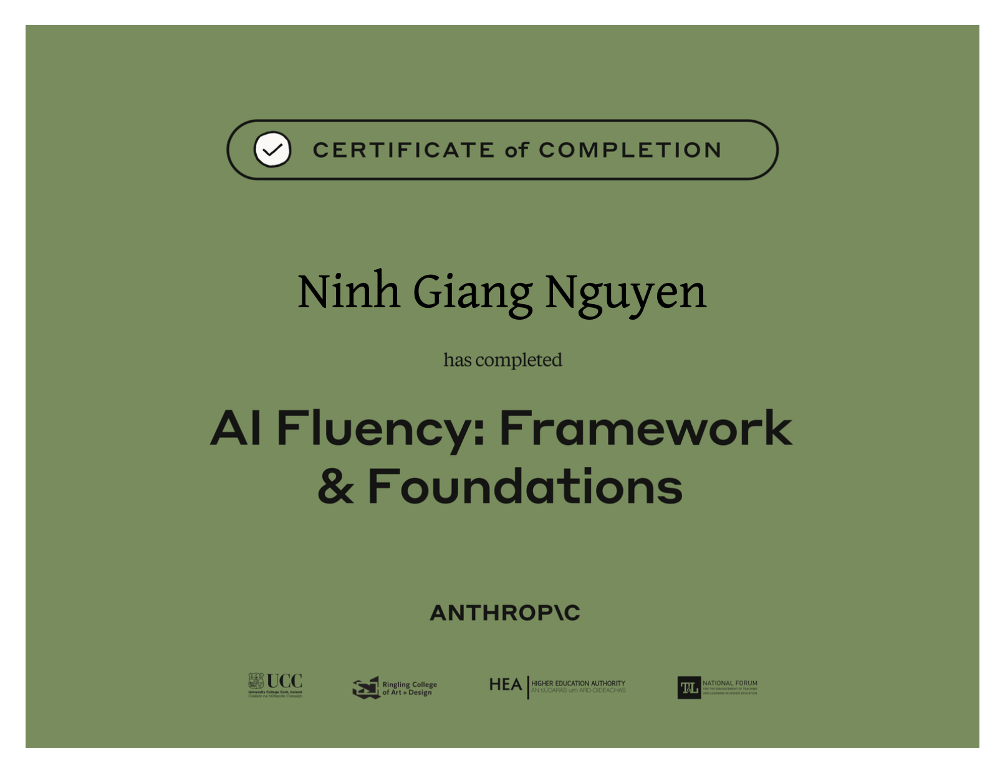

# AI Fluency

**Source:** [Anthropic - AI Fluency: Framework & Foundations](https://anthropic.skilljar.com/ai-fluency-framework-foundations)

**Key takeaways**
- This course focuses on human-AI collaboration, not just understanding AI as a technology
- AI Fluency means engaging with AI systems effectively, efficiently, ethically, and safely
- The AI Fluency Framework centers on the "4D" competencies of 
    - Delegation 
        - vision - you know what you want and expect what AI could produce, what work could by done by AI and by YOU
        - emphasizes that our domain expertise and judgment remain the foundation of effective AI collaboration
    - Description 
        - details - you give more concrete context expecting how AI approachs or behaves
        - clear communication that bridges our intentions and AI capabilities (Context, role, examples, constraint, steps, thought process)
    - Discernment 
        - evaluation - you can confidentially assert the AI ouptus correct or wrong within the systems constraints 
    - Diligence 
        - [Responsible AI](../responsible_ai/README.md) - fairness, trust, transparency, robustness, accountability...
        - Be honest about AI's role in your work with those who need to know (Stakeholders)

- The goal is to develop lasting skills that remain relevant as AI technology evolves
- Effective AI collaboration requires both practical skills and a fundamental shift in how we think about working with AI

**Topics**
- Generative AI 
- Effective Prompting techniques

## Generative AI 

- Generative AI creates new content (text, images, code) rather than just analyzing existing data.

- Modern systems like LLMs were made possible by three key developments:
  - Algorithmic and architectural breakthroughs (especially the transformer architecture)
  - Vast amounts of digital training data
  - Dramatic increases in computational power

- Generative AI learns through two stages:
  1. Pre-training (analyzing patterns across billions of examples)
  2. Fine-tuning (learning to follow instructions and provide helpful responses) or [RAG](../rag)

- Current capabilities include:
  - Versatility across tasks
  - Conversational awareness
  - The ability to connect with external tools

- Current limitations include:
  - Knowledge cutoff dates (get no in4 update after training time)
  - Potential for hallucinations (make up impossible but fake in4)
  - Context window constraints (no nothing outof context)
  - Non-deterministic output (each time asking might return different answer)
  - Challenges with complex reasoning (especially with mathematical reasonig with a lot of complex steps)
  - Lack of access to internal data (like a brilliant collegue cannot acccess company's database)

- The most effective applications combine human and AI strengths, with humans providing:
  - Critical thinking
  - Judgment
  - Creativity
  - Ethical oversight

## Effective Prompting techniques
[Here](5_DD2_Handout__6_Effective_Prompting_Techniques.pdf)