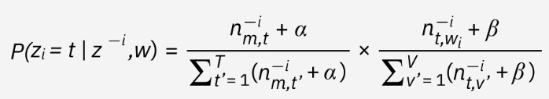

# Latent Dirichlet Allocation (LDA)

**Source:** [IBM - What is latent Dirichlet allocation?](https://www.ibm.com/think/topics/latent-dirichlet-allocation)

## Overview
Latent Dirichlet Allocation is a **topic modeling** technique used in Natural Language Processing (NLP) to uncover latent themes and their distributions across a collection of documents.

---

## Key Takeaways
* **Probabilistic Approach:** Built on Bayesian principles using unsupervised learning for large text datasets.
* **Generative Model:** Assumes documents are generated through random sampling of pre-existing topics.
* **Probabilistic Assignment:** Words are assigned probabilities of belonging to a topic rather than being forced into a discrete category.
* **Bag-of-Words (BoW):** LDA ignores word order and context, focusing instead on word frequency and co-occurrence within a **Document-Term Matrix (DTM)**.
* **Tools:** Commonly implemented using `scikit-learn` and `NLTK` (Natural Language Toolkit).

---

## Topic Generation
LDA identifies topics based on the statistical patterns of words.
1.  **Distribution:** Generates topic distributions according to word frequency and co-occurrences.
2.  **Logic:** Operates on the assumption that words appearing together frequently are likely part of the same underlying topic.

---

## The Gibbs Sampling Process
LDA utilizes an iterative process to update topic-word probabilities through multiple iterations, often employing **Markov Chain** techniques. 

The probability of a word $w$ in document $d$ belonging to topic $t$ is determined by two main factors:

| Ratio | Description | Formula Logic |
| :--- | :--- | :--- |
| **Topic Probability** | The probability of topic $t$ in document $d$. | $\frac{\text{Words in document } d \text{ belonging to topic } t}{\text{Total words in document } d}$ |
| **Word Probability** | The probability of word $w$ belonging to topic $t$. | $\frac{\text{Occurrences of } w \text{ in topic } t}{\text{Total word tokens in topic } t}$ |

Mathematical equation:

---

## Text Classification & Optimization
While LDA is an **unsupervised** method, the resulting annotations (topics) can be used as features to classify or organize texts.

### Pre-processing Steps
To optimize the model, the following NLP techniques are essential:
* **Stopword Removal:** Eliminating common, semantically irrelevant words (e.g., "the", "is", "at").
* **Lemmatization:** Reducing morphological variants to their base forms (e.g., "running" to "run").

### The Optimization Challenge
Because LDA is **probabilistic** rather than deterministic, there is no "correct" number of topics ($k$). Finding the ideal balance requires iterative testing and evaluation.

---

## Evaluation Metrics

### 1. Qualitative Evaluation
* **Method:** Humans examine the top 5–10 keywords for each topic.
* **Goal:** Determine how "interpretable" the topics are to a human reader.
* **Requirement:** Requires significant domain expertise and familiarity with the corpus.

### 2. Coherence Score
* **Method:** Measures the frequency with which a topic's most probable words co-occur across the corpus.
* **Calculation:** The model's overall coherence is the average of all individual topic coherence scores.
* **Exclusivity:** While coherence is quantifiable, topics should also maintain a degree of **exclusivity**, for which there is currently no standard quantitative measure.